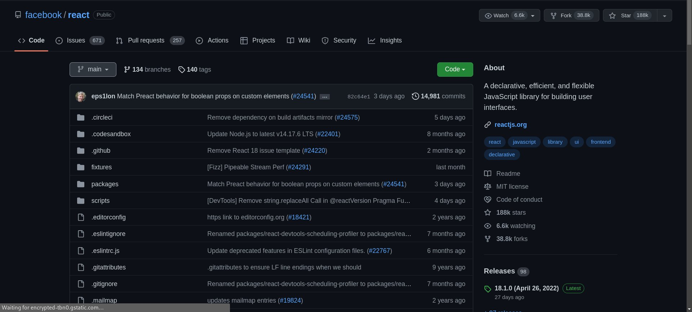
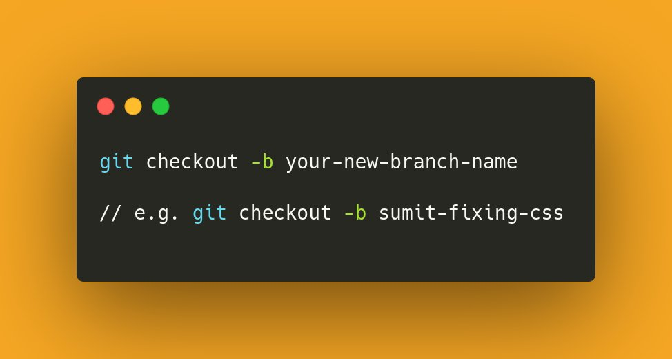

# How to get started with open source:

## First things first:

*Before you finalize a project, make sure that* :

➤ It has active maintainers.

➤ Last communication is not of a million years ago. Ensure that the

➤ There is a proper contribution guideline. Some projects may have a seperate contribution guidelines file while others may have it within the README.

➤ Lastly, explore the repo more for past chats of people who have already contributed to the project and to get a general feel of how things happen in that project's community. Remember, every community is different!

## Can only programmers contribute:

➤ One of the best things about open source community is that it is incredibly welcoming.

➤ And so there are ample opportunites for non-code contributions too.

➤ Also, you don't need to be an expert programmer. Open source is equally welcoming for experts and newbies.

➤ No gatekeeping whatsoever!

## Now, the process:

Contributing to open source basically involves a few simple steps and there are fancy names for each one of them:

1.  You make a copy of the project. This is necessary as it ensures that if the changes you make mess things up, it doesn't affect the app itself. This *'making a copy'* to play around is called **Forking** in the open source world

> Look at the second tab from the right to fork.

2. Then download your copy onto your machine to start playing around. This is called **Cloning**.

> Use the command in the image to clone a repository

3. Post cloning, we've to start playing around with what we've downloaded and once we've made any meaningful change,we can start to push those changes back to the Github repo. But before that we'd make what are called **Branches** for the following benefits:

   - Branches are essentially parallel channels for making changes so that they can be compared with the original files.
   - It helps in keeping things private and isolates the impact of change
   - In the following image, we're making a branch called 'sumit-fixing-css':

> Use the command in the image to creat a new branch