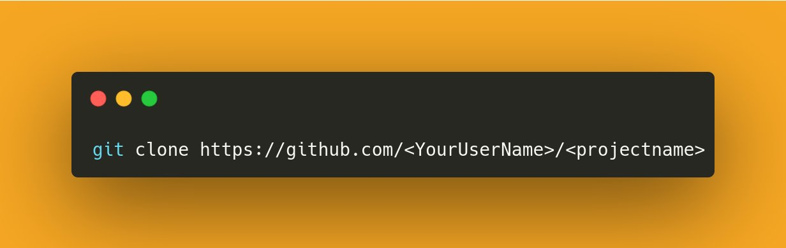

# How to get started with open source:

> Authors: Sumit ([Twitter](https://twitter.com/sumitsaurabh927))

## First things first:

*Before you finalize a project, make sure that* :

➤ It has active maintainers.

➤ Last communication is not of a million years ago. Ensure that the

➤ There is a proper contribution guideline. Some projects may have a seperate contribution guidelines file while others may have it within the README.

➤ Lastly, explore the repo more for past chats of people who have already contributed to the project and to get a general feel of how things happen in that project's community. Remember, every community is different!

## Can only programmers contribute:

➤ One of the best things about open source community is that it is incredibly welcoming.

➤ And so there are ample opportunities for non-code contributions too.

➤ Also, you don't need to be an expert programmer. Open source is equally welcoming for experts and newbies.

➤ No gatekeeping whatsoever!

## Now, the process:

Contributing to open source basically involves a few simple steps and there are fancy names for each one of them:

**1.**  You make a copy of the project. This is necessary as it ensures that if the changes you make mess things up, it doesn't affect the app itself. This *'making a copy'* to play around is called **Forking** in the open source world

> Look at the second tab from the right to fork.

<<<<<<< HEAD:contribute/README.md
**2.** Then download your copy onto your machine to start playing around. This is called **Cloning**.
=======
1. Then download your copy onto your machine to start playing around. This is called **Cloning**.
>>>>>>> upstream/main:guides/open-source-contributions.md

> Use the command in the image to clone a repository

**3.** Post cloning, we've to start playing around with what we've downloaded and once we've made any meaningful change,we can start to push those changes back to the Github repo. But before that we'd make what are called **Branches** for the following benefits:

   - Branches are essentially parallel channels for making changes so that they can be compared with the original files.
   - It helps in keeping things private and isolates the impact of change
   - In the following image, we're making a branch called 'sumit-fixing-css':

> Use the command in the image to create a new branch

**4.** And now the meaty stuff! Once done with what can be termed 'pre-requisites', we can now move on to the juicy stuff - *making actual contributions*. So, go ahead and open the downloaded (cloned) folder and make whatever changes you're assigned to or had ideas about. Then commit (create a checkpoint to restore if things go bad) and we're ready to push.

> Use the command in the image to commit (make a restore point)

**5.** Now let's push the changes! We push the changes we've made to Github so that the project's maintainers can see, review and if everything's okay, merge those changes into the project's original codebase.

> Use the push command as shown in the image to push changes to Github

6. Now let's hop over to out Github repository (repository is just a fancy term for folders of directories) and if you did the things right, there should be *'compare & pull request'* button. Click on it to let maintainers know that they should review your changes (It basically summons the maintainers).

> You should see this big green button

⚡ Congratulations, you just made a open source contribution.You can now do a little dance 🕺 to celebrate!